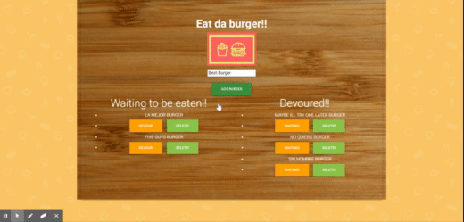

# Burger

* Burger! is a restaurant app that lets users input the names of burgers they'd like to eat.

## Getting Started

## Prerequisites for development
MySQL instance installed on your local machine or a MySQL instance deployed to a remote server (i.e. JawsDB on Heroku)
Node and NPM installed on your local machine.

## Installing
Follow the instructions in this section to get the app setup to run on your machine.

Clone the git project to your machine (example below is using ssh)

git clone git@github.com:jm27/burger.git
Install the node module dependencies from the package.json file

 npm install
Create a .env file in the top level directory. This will contain the variables to connect to your MySQL database. a. If you are using a local instance of MySQL, you will need the following variables included in your .env file. You will need to update, at minimum the LOCAL_DB_USER and LOCAL_DB_PASSWORD values to the db account you have setup in MySQL (replace everything to the right of the equals sign, including the carats <>):

# MySQL DB Variables
LOCAL_DB_USER=<user id>
LOCAL_DB_PASSWORD=<password>
LOCAL_DB_NAME=burgers_db
LOCAL_DB_HOST=localhost
LOCAL_DB_PORT=3306
b. If you are hosting your app on Heroku, use the JawsDB add-on that will create a MySQL instance for your app. The JAWSDB_URL variable will be set on Heroku and is referenced in the config/connection.js file. It will be used when present, else it will fall back to the LOCAL_DB variables. You can get the value for JAWSDB_URL in your Heroku app. 1. Go to your app and click on the Resources tab. 2. In the Add-ons section, find the JawsDB entry and click on the link. This will open a new browser tab and take you to the JawsDB website which will provide you with the connection string you can use to setup a connection in MySQL Workbench (or another MySQL tool). bash JAWSDB_URL='mysql://<username>:<password>@g3v9lgqa8h5nq05o.cbetxkdyhwsb.us-east-1.rds.amazonaws.com:3306/<dbname>'

Locate the schema.sql file in the db folder of the project. Execute all comamands if using a local MySQL instance to create the database and table definitions. Skip the top section with the CREATE DATABASE statement if hosting a JawsDB MySQL instance on Heroku since the database will have already been created for you.

Locate the seed.sql file in the db folder of the project. Execute the sql commands to populate the tables created in step 4 with sample data.

## Running the app
There is a start script in the package.json file that starts up the server and connects to the MySQL database. If you're deploying the app to Heroku, part of the deployment will automatically call this script to start the server. If you're running this on a local machine, navigate to the project folder and run the command:

npm start

## Demo

There is a demo of this app available on Heroku. You can interact with the app and see the full functionality. Some examples of the app's functionality:

* Add a burger in the input text box and click 'add a burger'. The new burger will be inserted into the database via a POST request and the page will refresh and show the new burger under the "Waiting to be Eaten" column.
* For a burger in the "Waiting to be Eaten" column, click on the button 'Devour'. This will "eat the burger" and move it to the "Devoured" column. Behind the scenes, the entry in the database will be updated to indicate it was eaten by a PUT request to the burgers API.
* For a burger in the "Devoured" column, click on the button 'Waiting'. This will move it back to the "Waiting to be eaten" column. The entry for this burger will be updated in the database using a PUT request.
* For either column, click on the 'Delete'. That will remove it from the page and also its entry from the database using a DELETE request.

## Visit Demo Site

[Burger-APP HEROKU LINK](https://burger-app-jm27.herokuapp.com/ "Homepage")
======

## Built With

* HTML.
* CSS.
* BOOTSTRAP.
* JAVASCRIPT.
* JQUERY.
* SQL Database.
* NPM('express','express-handlebars','mysql').

## Versioning
Burger V1.1

## Authors

* **Jesus Esquer** - *Main Contributor* - [jm27](https://github.com/jm27)

## Acknowledgments

* Thanks to Classmates, Instructors, and TA's .
* Bootcamp 2019-2020.
